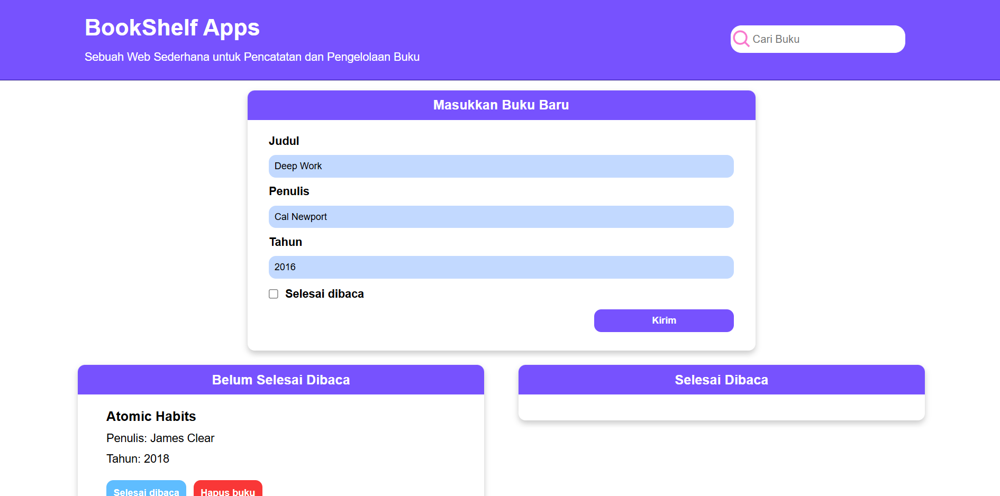

# 📚 ShelfSync - Web Pencatatan & Pengelolaan Buku

## 📖 Overview
Bookshelf App adalah aplikasi berbasis web untuk mengelola daftar buku yang sudah dan belum dibaca. Aplikasi ini menggunakan **HTML, CSS, dan JavaScript**, serta menyimpan data secara **permanen dengan localStorage** untuk memastikan buku yang telah ditambahkan tetap tersedia meskipun halaman diperbarui atau ditutup.

## ✨ Features
- Menambahkan buku dengan **judul, penulis, dan tahun terbit**
- Memindahkan buku antara kategori **Belum Dibaca** dan **Sudah Dibaca**
- Menghapus buku dari daftar
- Mencari buku berdasarkan **judul** secara real-time
- Data tetap tersimpan meskipun halaman direfresh berkat **localStorage**
- UI yang responsif dan mudah digunakan

## 🛠️ Tech Stack
- **Frontend**: HTML, CSS, JavaScript
- **Storage**: localStorage

## 📸 Screenshots


## 🏗️ Project Structure
```
bookshelf-app/
│── index.html      # Halaman utama aplikasi
│── style.css       # File gaya untuk tampilan UI
│── script.js       # Logika aplikasi
│── README.md       # Dokumentasi proyek
```

## 📌 To-Do
- [ ] Menambahkan fitur edit buku
- [ ] Mengimprovisasi tampilan UI/UX
- [ ] Menggunakan database sebagai alternatif penyimpanan
- [ ] Menambahkan fitur dark mode
- [ ] Menyediakan filter berdasarkan tahun terbit

## 💡 Contributing
Kontribusi sangat diharapkan! Jika ingin menambahkan fitur atau memperbaiki bug, silakan buat **pull request** atau **issue** pada repository ini.

## 📜 License
MIT License © 2024 Navy Nurlyn Ajrina
